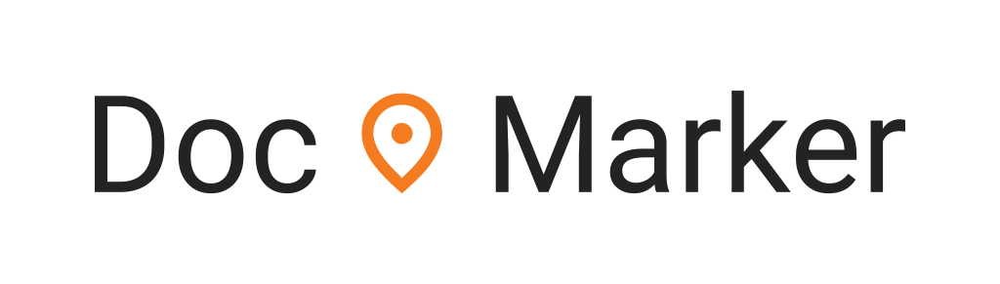

DocMarker
=========



DocMarker is an annotation tool for creating training data for the text-to-form information retrieval NLP task. You have a free-form text file and you want to fill out a structured form based on the information in that text. This tool lets you record and annotate this process.

DocMarker is meant to be extended with your own forms (or even custom logic). Therefore this repository holds the generic version of the tool. To see a specific extension, check out:

- [RES-Q+ DocMarker](https://github.com/Jirka-Mayer/resq-doc-marker)

The customization works by treating this repository as an NPM library that you include in your project. You then use this library in a simple HTML file, providing a configuration object that specifies any overrides. You build the whole system using [Parcel](https://parceljs.org/), which produces your final single-page web application.

For more information on how to create your own customization see the folder [`example-customization`](example-customization).


## Development

First, install all the dependencies:

```
npm ci
```

Then, you can start the development server:

```
npm run start
```

This starts parcel over the file `development/index.html`. The `development` folder contains files that boostrap a new instance of DocMarker with the default configuration. You should use this `development` folder instead of `example-customization`, because the customization is a separate NPM package that requires linking to DocMarker and this linking prevents Parcel from working its filesystem watching magic. This makes the development unbearable.

So when developing both the DocMarker and your own customization, you should run this DocMarker `development` server here, do modifications, and once you're ready, restart the Parcel process in your customization to apply these DocMarker changes in your customization. Then you can modify your customization to utilize the new DocMarker changes. 
